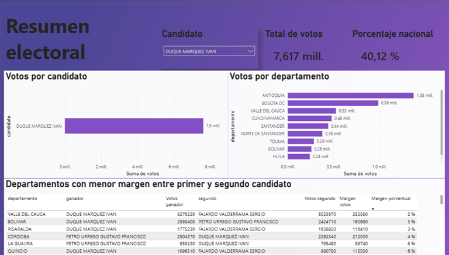
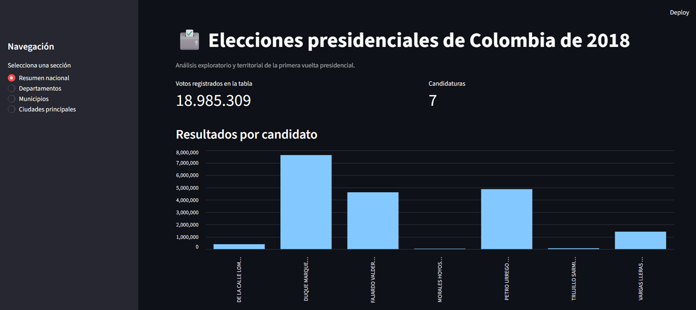
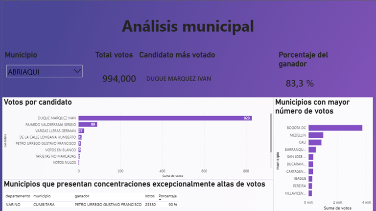

# Análisis de las elecciones presidenciales de Colombia de 2018





Proyecto de análisis exploratorio y territorial de los resultados de la primera vuelta presidencial de Colombia de 2018.

## Objetivo

Analizar la distribución de los votos por candidato, departamento y municipio, identificar territorios competitivos y examinar concentraciones elevadas del voto sin atribuirles causas que no puedan demostrarse con el conjunto de datos.

## Estructura del proyecto

```text
analisis-elecciones-colombia-2018/
│
├── data/
│   ├── raw/
│   └── processed/
│
├── notebooks/
│   └── analisis_electoral_2018.ipynb
│
├── dashboard/
│   ├── streamlit/
│   └── powerbi/
│
├── reports/
│   └── figures/
│
├── README.md
├── requirements.txt
└── .gitignore
```

## Tecnologías

- Python
- Pandas
- NumPy
- Matplotlib
- Seaborn
- Jupyter Notebook
- Streamlit
- Power BI

## Ejecución

### 1. Crear y activar el entorno virtual

```powershell
python -m venv .venv
. .venv\Scripts\Activate.ps1
python -m pip install --upgrade pip
```

### 2. Instalar las dependencias

```powershell
pip install -r requirements.txt
```

### 3. Ejecutar el análisis

Abrir el notebook:

```text
notebooks/analisis_electoral_2018.ipynb
```

Ejecutar todas las celdas.

El notebook:

- carga los datos desde `data/raw/`;
- genera las tablas en `data/processed/`;
- exporta las figuras a `reports/figures/`.

### 4. Ejecutar Streamlit

```powershell
streamlit run dashboard/streamlit/app.py
```

## Alcance metodológico

Los resultados muestran patrones descriptivos de votación. Una concentración elevada del voto en un candidato no constituye por sí sola evidencia de una irregularidad electoral.

El conjunto de datos no incluye el potencial electoral municipal. Por esta razón, no permite calcular correctamente la tasa de participación ni identificar municipios donde votó menos del 25 % del censo electoral.

Las conclusiones del proyecto se limitan a los patrones observados en los resultados electorales disponibles.

## Fuente de datos

Datos obtenidos del [Centro de Estudios en Democracia y Asuntos Electorales (CEDAE)](https://cedae.datasketch.co/).

Archivo utilizado:

```text
data/raw/2018_presidencia_primera_vuelta.dta.csv
```

## Hallazgos principales

- Iván Duque obtuvo la mayor votación nacional en la primera vuelta.
- Bogotá, Antioquia y Valle del Cauca concentraron los mayores volúmenes de votos.
- Los márgenes departamentales permiten distinguir territorios altamente competitivos y territorios con dominio amplio de una candidatura.
- El análisis municipal identificó un caso que superó el criterio descriptivo de concentración igual o superior al 90 %, considerando municipios con al menos 100 votos válidos para candidatos.
- Las concentraciones elevadas constituyen un hallazgo descriptivo y no representan evidencia de irregularidad electoral.

## Dashboard interactivo en Streamlit

La aplicación permite consultar los resultados nacionales y explorar la información por departamento, municipio y ciudades principales.



## Dashboard de Power BI

El archivo editable se encuentra en:

```text
dashboard/powerbi/dashboard_elecciones_colombia_2018.pbix
```

Para visualizarlo:

1. Instalar **Power BI Desktop**.
2. Abrir el archivo ubicado en la ruta anterior.

### Resumen nacional


### Análisis municipal



## Autor

**Saady Alberto García Galvis**

- Ingeniería de Sistemas
- Python
- SQL
- Power BI
- Machine Learning

- GitHub: https://github.com/sartocol87
- LinkedIn: ## Autor

**Saady Alberto García Galvis**

- Ingeniería de Sistemas
- Python
- SQL
- Power BI
- Machine Learning

- GitHub: https://github.com/sartocol87
- LinkedIn: www.linkedin.com/in/saady-garcia-310012336